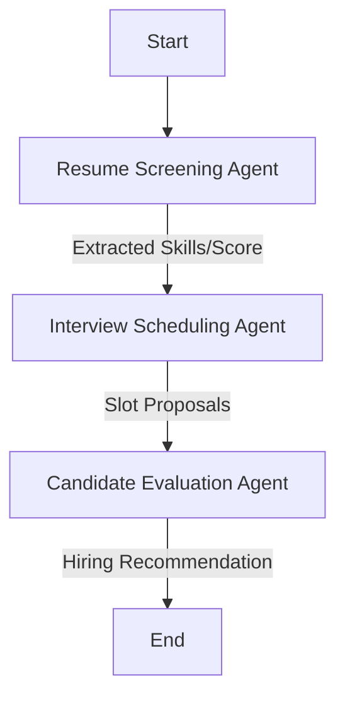

# Recruitment Pipeline AI Workflow

A professional multi-agent recruitment platform powered by **LangGraph**, **Groq**, and **LangSmith**.

## 🚀 Architecture Overview
The application uses a 3-agent sequential workflow built with LangGraph to process candidate resumes and generate hiring evaluations.

### Agent Workflow Diagram


### Tech Stack
- **Frontend**: Next.js 15, Tailwind CSS, Framer Motion, Lucide Icons
- **Backend**: FastAPI (Python), LangGraph, LangChain
- **LLMs**: Groq (Llama 3.1 70B)
- **Observability**: LangSmith

## 🛠️ Local Setup

### 1. Backend Configuration
1. Navigate to `backend/`
2. Install dependencies: `pip install -r requirements.txt`
3. Configure `.env` with your keys:
   ```env
   GROQ_API_KEY=your_key
   LANGSMITH_API_KEY=your_key
   LANGCHAIN_TRACING_V2=true
   LANGCHAIN_PROJECT=recruitment-pipeline
   ```
4. Run server: `python main.py`

### 2. Frontend Configuration
1. Navigate to `frontend/`
2. Install dependencies: `npm install`
3. Run development server: `npm run dev`

## ☁️ Deployment (Vercel)

### Architecture for Vercel
To deploy this as a monolithic project on Vercel:
1. Move `backend/main.py` functions into a `/api` directory if using the Next.js Python integration.
2. Ensure `requirements.txt` is in the root or accessible to the builder.
3. Add Environment Variables (`GROQ_API_KEY`, etc.) in the Vercel Project Settings.

**Recommended Production Strategy**:
- Deploy the **Next.js** app to **Vercel**.
- Deploy the **FastAPI/LangGraph** backend to a specialized service like **Render**, **Railway**, or **AWS Lambda**.
- Update the API URL in `frontend/app/page.tsx`.

## 📈 Observability & Monitoring
All executions are traced via **LangSmith**. Visit your LangSmith dashboard to see:
- Node-by-node execution latency.
- LLM prompt/response pairs.
- Full state transitions across the graph.
